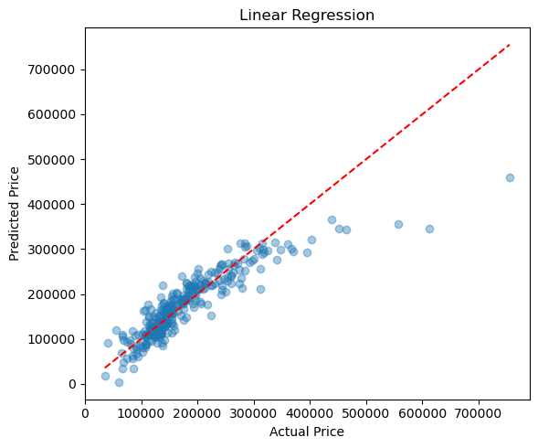
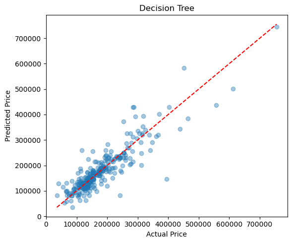
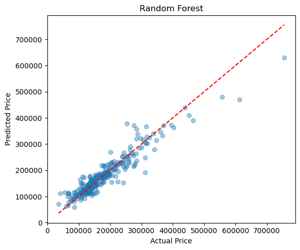
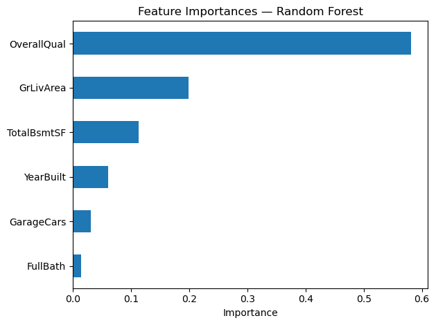

# Predicting Housing Prices

James Dietmann

AAE 718

6/14/26

## Introduction

Housing prices are influenced by many factors including size, quality, age, and amenities. Predicting the price of a house is useful for both buying and selling a home. The goal of this proiject is to build a model that accurately predicts the price of a house using a set of characteristics. Three models including linear regression, a decision tree, and a random forest will be used to predict housing prices and then compared. 

## Methods

The dataset used for this project comes from House Prices: Advanced Regression Techniques dataset in Kaggle. The dataset contains 1,460 homes and 81 variables describing various characteristics of each property. Six features were selected to target the sales price which included overall quality, above-ground living area, garage space, basement area, number of full bathrooms, and age of the home. The dataset was divided into training and testing sets using an 80/20 train-test split. 

## Results

The linear regression graph pictured here shows us that as the real price for the home increases, the predicted prices gets further from actaul. At lower values the prediction is pretty good with most values clustered around the perfect prediction line. As values increase, the predicted price is lower than the actual. The training score for this model is 0.759 and the testing score is 0.794. 

This graph of the deciscion tree model appears that the predictions remain closer than the linear regression as home value increases. There is no tail off like in the linear regression graph, however at all values, the predictions are not tightly clustered around the perfect prediction line. When looking at the errors, both the root mean squared error and the mean absolute error are higher than those of the linear regression model. the training score for this model is 0.99 and the testing score is 0.778. The testing score being lower than the linear regression testing score means that linear regression was a better predicter in this case. 

The random forest model shown in this graph performed the best. The predictions weren't perfect, as can be seen with the predicted prices being lower than actaul as the value of the homes increases. This is similar to the linear regression model, except the differeces weren't nearly as large. At low values the predictions were clustered around the perfect prediction line which is good. The training score for this model is 0.974 and the testing score was 0.89. The testing score is significantly better than either of the other two models. The RMSE and MAE were also much lower than the other models indicating that the random forest is a better predicter.

## Discussion

The results suggest that a relatively small number of housing characteristics can explain a large portion of housing price variation. The models performed reasonibly well, with the random forest model doing the best at predicting house prices.

 It's clear that overall quality of the house is the most important feature in determining house price. This is followed by above-ground living area and basement area. One of the limitations of the project was only using six variables when there are many more that may impact the sales price. Including additional variables into the models would be one example of a future improvement. 